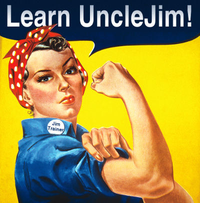

A set of exercises for learning functional programming with [UncleJim](https://github.com/GlenKPeterson/UncleJim) in Java.

#Requirements:
 - [Java 8+](https://jdk8.java.net/download.html)

 - [Maven 3.2+](http://maven.apache.org/download.cgi)

 - A text editor or IDE

 - Download [UncleJim](https://github.com/GlenKPeterson/UncleJim) and run `mvn clean install` on it.  Hopefully it will be in Sonatype / Maven Central soon to eliminate this step.

#Usage 
 - Run `mvn clean test` on this project (JimTrainer)
 
 - Uncomment [unit tests](src/test/java) and make them pass.  Start with Easy, then progress.

#Picture Credit
"We Can Do It!" by J. Howard Miller, artist employed by Westinghouse, poster used by the US War Production Co-ordinating Committee - From scan of copy belonging to the National Museum of American History, Smithsonian Institution, retrieved from the website of the Virginia Historical Society.. Licensed under Public Domain via Commons - https://commons.wikimedia.org/wiki/File:We_Can_Do_It!.jpg#/media/File:We_Can_Do_It!.jpg  Modified and repurposed by Glen Peterson.
